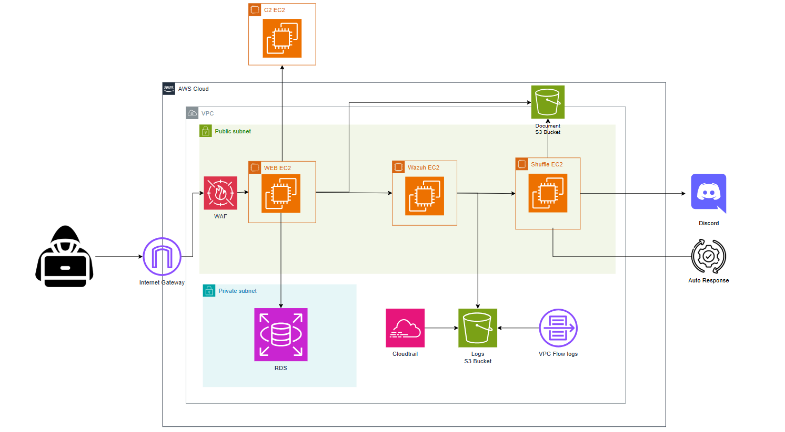
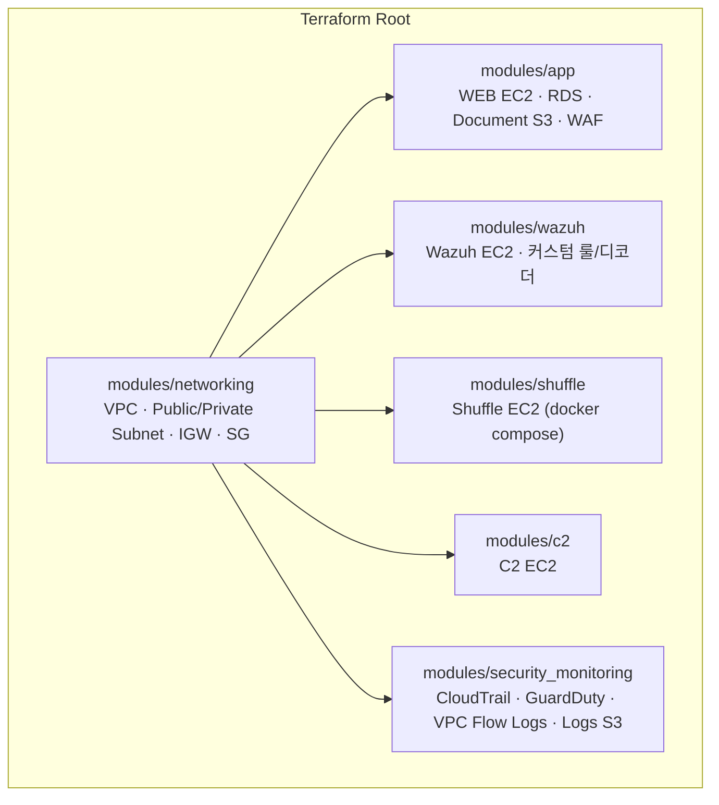
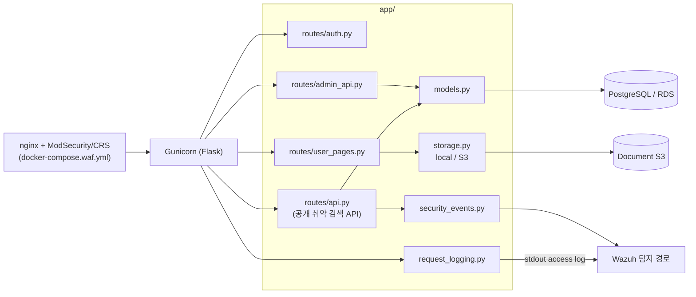
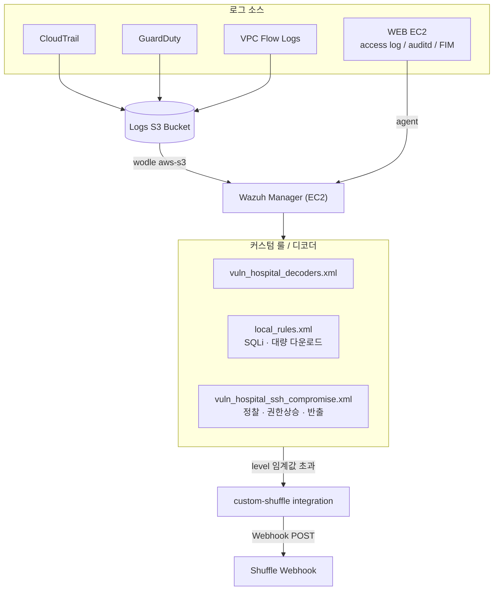
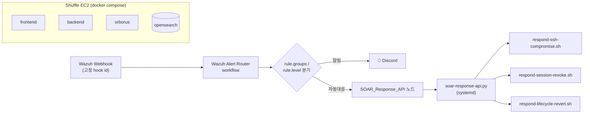

# 🏥 autosoc-lab

**취약한 병원 예약 웹 애플리케이션**을 미끼로 AWS 위에 SQLi / SSRF / RCE / SSE-C 등 실제 공격 표면을 만들고,
**Wazuh(SIEM)**로 탐지하고 **Shuffle(SOAR)**로 자동 대응까지 엔드투엔드로 재현하는 **자동화 SOC 실습 플랫폼**입니다.

4개의 레포지토리(앱, 인프라, C2, SOAR)가 하나의 실습 시나리오로 연결되어 있으며, `terraform apply` 한 번으로
공격 대상 웹앱 + WAF + SIEM + SOAR 전체 파이프라인이 AWS에 배포됩니다.

> ⚠️ 모든 취약점과 인프라 설정은 **보안 실습 전용으로 의도적으로 도입**되었습니다. 프로덕션 환경에서 사용하지 마세요.

---

## 프로젝트 개요

| 목표 | 내용 |
| --- | --- |
| 공격 시뮬레이션 | SQL Injection, 세션 토큰 탈취, SSRF를 통한 EC2 인스턴스 크리덴셜 탈취, 유출 SSH 키 기반 권한 상승, S3 SSE-C 랜섬웨어 등 |
| 탐지 | Wazuh가 호스트 이벤트(FIM/auditd/access log)와 AWS 로그(CloudTrail·GuardDuty·VPC Flow Logs)를 통합 룰 매칭 |
| 대응 | Wazuh 알림을 Shuffle 웹훅으로 전달 → 워크플로가 Discord 알림 + 자동 대응(API 키 폐기, 인스턴스 격리, 세션 revoke 등) 실행 |
| 인프라 | Terraform으로 VPC/EC2/RDS/S3/CloudTrail/GuardDuty까지 전체를 코드로 재현·정리(destroy) 가능 |

---

## 전체 공격 · 탐지 흐름



- **정찰 → 침투**: 공격자가 WAF를 우회/통과해 WEB EC2의 취약 SQLi 엔드포인트나 SSRF 지점을 공격
- **탈취 경로**: SSRF로 EC2 메타데이터에서 인스턴스 크리덴셜을 탈취해 `vuln-hospital-booking-c2`(C2 EC2)로 반출
- **탐지 경로**: WEB EC2의 access log/FIM/auditd + CloudTrail/GuardDuty/VPC Flow Logs(모두 Logs S3 경유) → Wazuh 매니저가 룰 매칭
- **대응 경로**: Wazuh → `custom-shuffle` integration → Shuffle 웹훅 → 워크플로 → Discord 알림 + 자동 대응 API 호출

---

## 상세 아키텍처

### 1. 인프라 구조 (`vuln-hospital-booking-infra`)



`main.tf`가 위 모듈들을 조립해 VPC 하나에 실습에 필요한 전체 스택(공격 대상, 탐지, 대응, 공격자 인프라)을 함께 생성합니다.
`ssh/vuln-hospital-lab.pem`은 유출 SSH 키 기반 권한 상승 실습용으로 의도적으로 배포되는 키입니다.

### 2. 웹 애플리케이션 구조 (`vuln-hospital-booking`)



`/api/doctors/search`, `/api/public/clinic-guides/search`는 인증 없이 호출 가능한 **의도적 SQLi 취약** 엔드포인트이며,
로그인 세션은 실습을 위해 DB에 평문 토큰으로 저장됩니다. `storage.py`는 `STORAGE_BACKEND` 설정으로 로컬 파일시스템과
S3(Document S3 Bucket)를 오갈 수 있는 추상화 계층입니다.

### 3. Wazuh(SIEM) 구조



CloudTrail/GuardDuty/VPC Flow Logs는 별도 연동 없이 `wodle aws-s3`가 Logs S3 버킷을 직접 읽어 룰 매칭하므로,
호스트 이벤트와 AWS 로그 이벤트가 Wazuh 입장에서는 동일한 파이프라인으로 처리됩니다.

### 4. Shuffle(SOAR) 구조



Shuffle EC2는 `ec2:ModifyInstanceAttribute`, `iam:UpdateAccessKey`, `s3:Get*` 등 최소 권한의 instance profile을 가지며,
워크플로 Executions 화면에서 Discord 알림과 SOAR API 호출 단계를 함께 확인할 수 있습니다. 라우팅 규칙 상세는
[`vuln-hospital-booking-soar/PLAYBOOKS.md`](https://github.com/autosoc-lab/vuln-hospital-booking-soar/blob/main/PLAYBOOKS.md) 참고.

---

## 레포지토리 구성

| 레포 | 역할 | 주요 내용 |
| --- | --- | --- |
| [**vuln-hospital-booking**](https://github.com/autosoc-lab/vuln-hospital-booking) | 공격 대상 웹앱 | Flask 기반 병원 예약 시스템. 의도적 SQLi 공개 API, 평문 세션 토큰, ModSecurity/CRS WAF 옵션, 로컬/S3 문서 저장소, `case-study/`에 SQLi·RCE·SSRF·SSE-C 시나리오 문서 포함 |
| [**vuln-hospital-booking-infra**](https://github.com/autosoc-lab/vuln-hospital-booking-infra) | AWS 인프라 (IaC) | Terraform으로 VPC/EC2(WEB·Wazuh·Shuffle·C2)/RDS/S3/CloudTrail/GuardDuty를 일괄 배포. 유출 SSH 키 기반 권한 상승 실습(취약 백업 헬퍼, systemd 타이머)도 함께 구성 |
| [**vuln-hospital-booking-c2**](https://github.com/autosoc-lab/vuln-hospital-booking-c2) | 공격자 C2 서버 | SSRF로 탈취한 EC2 인스턴스 크리덴셜 등 유출 아티팩트를 수신하는 FastAPI 기반 로컬/EC2 수집 서버(`/upload`). `ssrf_steal_ec2_creds.sh`로 탈취 시나리오 재현 |
| [**vuln-hospital-booking-soar**](https://github.com/autosoc-lab/vuln-hospital-booking-soar) | SOAR 계층 | 오픈소스 self-host [Shuffle](https://github.com/Shuffle/Shuffle) 배포. Wazuh 알림을 웹훅으로 받아 Discord 알림 + 자동 대응(SSH 침해 대응, 세션 revoke 등) 워크플로 실행. `PLAYBOOKS.md`에 라우팅 규칙 정리 |

> Wazuh 매니저 자체는 별도 레포 없이 `vuln-hospital-booking-infra`의 `modules/wazuh`(커스텀 룰/디코더 포함)로 관리됩니다.

---

## 빠른 시작

```bash
git clone https://github.com/autosoc-lab/vuln-hospital-booking-infra
cd vuln-hospital-booking-infra
# terraform.tfvars의 <CHANGE_ME> 값 채우기
terraform init
terraform apply -target=module.networking -target=module.security_monitoring
terraform apply
# 실습 종료 후 반드시
terraform destroy
```

각 구성 요소의 상세 배포/운영 방법은 개별 레포의 README를 참고하세요.
