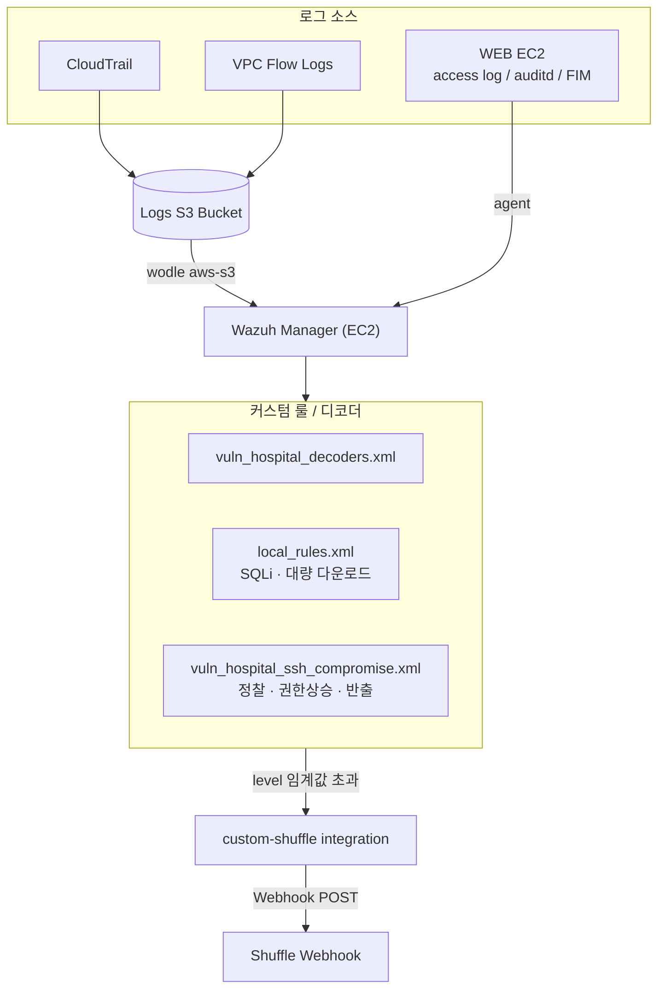
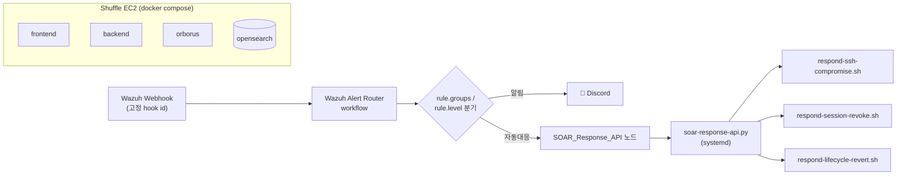

# autosoc-lab

**취약한 병원 예약 웹 애플리케이션**을 미끼로 AWS 위에 SQLi / SSRF / RCE / SSE-C 등 실제 공격 표면을 만들고,
Wazuh(SIEM)로 탐지하고 Shuffle(SOAR)로 자동 대응까지 엔드투엔드로 재현하는 **자동화 SOC 실습 플랫폼**입니다.

4개의 레포지토리(앱, 인프라, C2, SOAR)가 하나의 실습 시나리오로 연결되어 있으며, Terraform으로 공격 대상 웹앱 + WAF + SIEM + SOAR 전체 파이프라인을 AWS에 재현할 수 있습니다.

>  모든 취약점과 인프라 설정은 **보안 실습 전용으로 의도적으로 도입**되었습니다. 프로덕션 환경에서 사용하지 마세요.

---

## 프로젝트 개요

| 목표 | 내용 |
| --- | --- |
| 공격 시뮬레이션 | SSRF를 통한 EC2 인스턴스 크리덴셜 탈취, 유출 SSH 키 기반 권한 상승, S3 SSE-C 랜섬웨어 등 |
| 탐지 | Wazuh가 호스트 이벤트(FIM/auditd/access log)와 AWS 로그(CloudTrail·VPC Flow Logs)를 통합 룰 매칭 |
| 대응 | Wazuh 알림을 Shuffle 웹훅으로 전달 → 워크플로가 Discord 알림 + 자동 대응(API 키 폐기, 인스턴스 격리, 세션 revoke 등) 실행 |
| 인프라 | Terraform으로 VPC/EC2/RDS/S3/CloudTrail까지 전체를 코드로 재현·정리(destroy) 가능 |

---

## 전체 공격 · 탐지 흐름


### 시나리오 1. SSRF → EC2 자격증명 탈취 → SSE-C 랜섬웨어

1. 진료 의뢰서 첨부 입력에서 서버가 대신 외부로 요청을 보내는 지점을 찾아 SSRF 취약점을 확인한다.
2. SSRF로 EC2 메타데이터에 접근해 인스턴스 role의 자격증명을 탈취하고, 이를 이용해 인프라에 진입한다.
3. role 권한으로 민감 문서가 담긴 S3 객체에 접근해 SSE-C로 재암호화(랜섬웨어)하고, lifecycle을 걸어 원본이 자동 삭제되게 만든다.
4. 암호화한 파일을 공격자 C2 서버로 반출한다.

### 시나리오 2. 유출 SSH 키 → 권한상승 → 의료 데이터 반출

1. 유출된 SSH 개인키로 `deploy` 계정에 로그인해 앱 서버에 발판을 확보하고, 내부 정찰로 root가 15분마다 돌리는 백업 체계를 파악한다.
2. 백업 스크립트가 호출하는 헬퍼(`/opt/hospital/bin/hospital-backup-helper`)가 그룹 쓰기 가능함을 발견해 코드를 심고, 다음 타이머 실행 때 root 권한으로 실행시켜 권한을 상승시킨다.
3. root 권한으로 `app.env`를 탈취해 DB 접속 정보를 확보하고, PostgreSQL에서 환자·예약·의료문서 데이터를 조회·수집한다.
4. 수집물을 압축해 C2 서버로 반출한 뒤 흔적을 지우려 하지만, root 소유 파일은 `/tmp`의 sticky bit 때문에 `deploy` 계정이 지우지 못해 흔적이 남는다.

---

**탐지 · 대응**: WEB EC2의 access log/FIM/auditd + CloudTrail/VPC Flow Logs(모두 Logs S3 경유) → Wazuh 매니저가 룰 매칭 → `custom-shuffle` integration → Shuffle 웹훅 → 워크플로 → Discord 알림 + 자동 대응 API 호출

---

## 상세 아키텍처

### 1. 인프라 구조 (`vuln-hospital-booking-infra`)

`vuln-hospital-booking-infra`는 AWS 실습 환경을 Terraform으로 배포하는 인프라 레포입니다. 하나의 VPC 안에 공격 대상 웹앱, RDS, S3 문서 버킷, Wazuh SIEM, Shuffle SOAR, C2 서버, CloudTrail/VPC Flow Logs 기반 로그 수집 환경을 구성합니다.

| 모듈 | 역할 |
| --- | --- |
| `networking` | VPC, 서브넷, 보안그룹 구성 |
| `app` | WEB EC2, RDS, S3 문서 버킷, WAF 배포 |
| `security_monitoring` | CloudTrail, VPC Flow Logs, Logs S3 구성 |
| `wazuh` | Wazuh 서버와 커스텀 룰·디코더 배포 |
| `shuffle` | Shuffle SOAR와 대응 API 구성 |
| `c2` | 유출 데이터 수신용 C2 서버 구성 |

웹앱 서버의 access log, auditd, FIM 이벤트는 Wazuh Agent를 통해 수집되고, CloudTrail/VPC Flow Logs는 Logs S3 Bucket을 거쳐 Wazuh가 분석합니다. Wazuh에서 발생한 알림은 Shuffle 웹훅으로 전달되어 Discord 알림과 자동 대응으로 이어집니다.

SSH 유출 시나리오를 위해 앱 EC2에는 `deploy` 계정과 실습용 SSH 키, 그리고 그룹 쓰기 권한이 열린 백업 헬퍼 파일이 의도적으로 구성되어 있습니다. 이를 통해 SSH 침투, 권한 상승, 데이터 수집·반출, 탐지·대응 흐름을 재현할 수 있습니다.

### 2. 웹 애플리케이션 구조 (`vuln-hospital-booking`)

**진입점**: nginx + ModSecurity/CRS(`docker-compose.waf.yml`) → Gunicorn(Flask)

**주요 모듈 (`app/`)**

| 모듈 | 역할 |
| --- | --- |
| `routes/auth.py` | 로그인/회원가입 (세션은 DB에 평문 토큰으로 저장) |
| `routes/api.py` | 공개 검색 API 등 주요 엔드포인트 |
| `routes/admin_api.py` | 관리자용 API (`api.py`의 serializer 재사용) |
| `routes/user_pages.py` | 사용자 페이지 |
| `models.py` | PostgreSQL/RDS ORM 모델 |
| `storage.py` | 로컬/S3 저장소 추상화 — `api.py`에서만 사용 |
| `pdf.py` | ReportLab 기반 PDF 생성 |
| `request_logging.py` / `security_events.py` | 요청·보안 이벤트를 파일 로그로 기록 → Wazuh가 tail |

로그인 세션은 실습을 위해 DB에 평문 토큰으로 저장됩니다. `storage.py`는 `STORAGE_BACKEND` 설정으로 로컬 파일시스템과
S3(Document S3 Bucket)를 오갈 수 있는 추상화 계층이지만 실제로는 `api.py`(관리자용 업로드/다운로드)에서만 쓰이고,
`user_pages.py`의 환자 문서 다운로드는 이 추상화를 거치지 않고 `DOCUMENT_STORAGE_ROOT` 로컬 경로를 직접 읽습니다.
`admin_api.py`는 `api.py`의 serializer 함수를 그대로 재사용합니다.

### 3. Wazuh(SIEM) 구조



CloudTrail/VPC Flow Logs는 별도 연동 없이 `wodle aws-s3`가 Logs S3 버킷을 직접 읽어 룰 매칭하므로,
호스트 이벤트와 AWS 로그 이벤트가 Wazuh 입장에서는 동일한 파이프라인으로 처리됩니다.

### 4. Shuffle(SOAR) 구조



Shuffle EC2는 `ec2:ModifyInstanceAttribute`, `iam:UpdateAccessKey`, `s3:Get*` 등 최소 권한의 instance profile을 가지며,
워크플로 Executions 화면에서 Discord 알림과 SOAR API 호출 단계를 함께 확인할 수 있습니다. 라우팅 규칙 상세는
[`vuln-hospital-booking-soar/PLAYBOOKS.md`](https://github.com/autosoc-lab/vuln-hospital-booking-soar/blob/main/PLAYBOOKS.md) 참고.

---

## 레포지토리 구성

| 레포 | 역할 | 주요 내용 |
| --- | --- | --- |
| [**vuln-hospital-booking**](https://github.com/autosoc-lab/vuln-hospital-booking) | 공격 대상 웹앱 | Flask 기반 병원 예약 시스템. 의도적 SQLi 공개 API, 평문 세션 토큰, ModSecurity/CRS WAF 옵션, 로컬/S3 문서 저장소, `case-study/`에 SQLi·RCE·SSRF·SSE-C 시나리오 문서 포함 |
| [**vuln-hospital-booking-infra**](https://github.com/autosoc-lab/vuln-hospital-booking-infra) | AWS 인프라 (IaC) | Terraform으로 VPC/EC2(WEB·Wazuh·Shuffle·C2)/RDS/S3/CloudTrail을 일괄 배포. 유출 SSH 키 기반 권한 상승 실습(취약 백업 헬퍼, systemd 타이머)도 함께 구성 |
| [**vuln-hospital-booking-c2**](https://github.com/autosoc-lab/vuln-hospital-booking-c2) | 공격자 C2 서버 | SSRF로 탈취한 EC2 인스턴스 크리덴셜 등 유출 아티팩트를 수신하는 FastAPI 기반 로컬/EC2 수집 서버(`/upload`) |
| [**vuln-hospital-booking-soar**](https://github.com/autosoc-lab/vuln-hospital-booking-soar) | SOAR 계층 | 오픈소스 self-host [Shuffle](https://github.com/Shuffle/Shuffle) 배포. Wazuh 알림을 웹훅으로 받아 Discord 알림 + 자동 대응(SSH 침해 대응, 세션 revoke 등) 워크플로 실행. `PLAYBOOKS.md`에 라우팅 규칙 정리 |

> Wazuh 매니저 자체는 별도 레포 없이 `vuln-hospital-booking-infra`의 `modules/wazuh`(커스텀 룰/디코더 포함)로 관리됩니다.

---

## 빠른 시작

```bash
git clone https://github.com/autosoc-lab/vuln-hospital-booking-infra
cd vuln-hospital-booking-infra
# terraform.tfvars의 <CHANGE_ME> 값 채우기
terraform init
terraform apply -target=module.networking -target=module.security_monitoring
terraform apply
# 실습 종료 후 반드시
terraform destroy
```

각 구성 요소의 상세 배포/운영 방법은 개별 레포의 README를 참고하세요.
